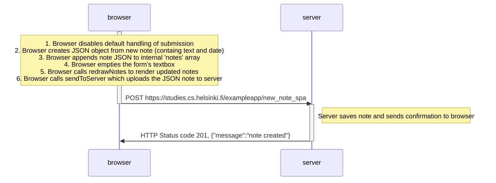

```mermaid
sequenceDiagram
    participant browser
    participant server

    activate browser
    Note over browser: 1. Browser disables default handling of submission <br> 2. Browser creates JSON object from new note (containg text and date) <br> 3. Browser appends note JSON to internal 'notes' array <br> 4. Browser empties the form's textbox <br> 5. Browser calls redrawNotes to render updated notes <br> 6. Browser calls sendToServer which uploads the JSON note to server 
    browser->>server: POST https://studies.cs.helsinki.fi/exampleapp/new_note_spa
    deactivate browser
    
    activate server
    Note right of server: Server saves note and sends confirmation to browser
    server->>browser: HTTP Status code 201, {"message":"note created"}
    deactivate server
```